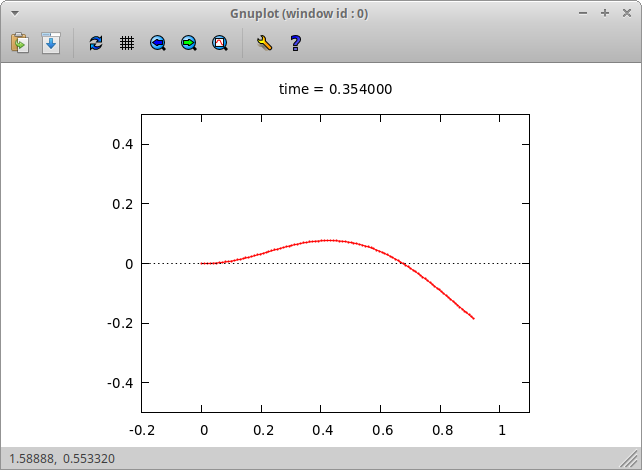

# Self-Propelled Filament Buckling

## Description

Simulation of the dynamics of an elastic filament with tangential self-propulsion used in the research article [*Buckling instabilities and spatio-temporal dynamics of active elastic filaments*, J. R. Soc. Interface 17: 20190794.](http://dx.doi.org/10.1098/rsif.2019.0794) by Yaouen Fily, Priya Subramanian, Tobias M. Schneider, Raghunath Chelakkot, and Arvind Gopinath.

## Features

- Numerical solution of the partial differential equations for the dynamics of an elastic filament with tangential self propulsions with various boundary conditions (free end, fixed end, clamped end, point viscous load).

- Live preview of filament motion.

    
    

## Installation

Only tested in linux. Requires boost (filesystem, system, iostreams) and trilinos (epetra, amesos, teuchos) libraries. On an ubuntu-like system you can install those with something like:

`> sudo apt install libboost-filesystem-dev libboost-system-dev libboost-iostreams-dev libtrilinos-epetra-dev libtrilinos-amesos-dev libtrilinos-teuchos-dev`

The live preview feature requires gnuplot.

Once dependencies are installed, compile with `make`. You may need to edit the Makefile to reflect where you installed the dependencies.

## Use

After compilation, run

`> execute parameters.txt`

To change parameter values, edit `parameters.txt` and run again. Live preview parameters 

Edit the parameter file `parameters_clamped.dat`. 

## Attribution

If you use this work, please cite [Fily Y, Subramanian P,
Schneider TM, Chelakkot R, Gopinath A. 2020
Buckling instabilities and spatio-temporal
dynamics of active elastic filaments. J. R. Soc.
Interface 17: 20190794.
http://dx.doi.org/10.1098/rsif.2019.0794](http://dx.doi.org/10.1098/rsif.2019.0794).

## Author

Written by Yaouen Fily.

"parameters/configFile" written by Richard J. Wagner.

"RNG/RNG_taus" written by James Theiler, Brian Gough. Modified A. Alan Middleton. Modified by Yaouen Fily.

"io/gnuplot-iostream" written by Daniel Stahlke.
